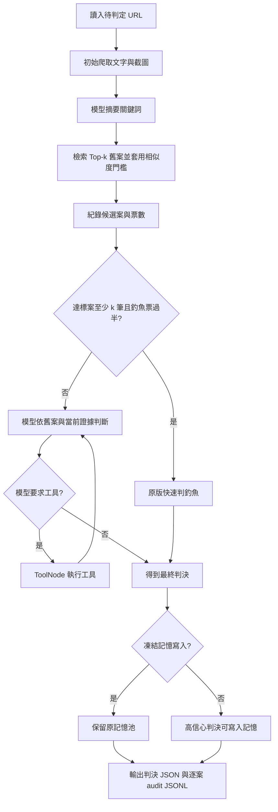

# 研究進度與實作導讀：2026-10-06

## 目前做到哪裡

題目維持「MemoPhishAgent 記憶投票一致性與判決可靠性：補充取證的效果與成本分析」。目前完成研究紀錄功能、候選資料切分，以及離線邏輯與框架整合驗證。沒有呼叫付費 API、沒有偵測真實網站、沒有建立真實記憶快照；目前不能報告偵測 Accuracy、Precision、Recall、F1 或成本改善。

上一階段紀錄與候選切分統計請看 `ENVIRONMENT_AND_SPLITS_20261006.md`。此次新增的是「實際框架整合測試」和「切分規則測試」，不是另一套偵測方法。

## 為什麼這次還要增加測試

移轉包原有七項測試以 AST 取出實際類別，再用外部服務替身執行，能檢查投票與資料紀錄邏輯。但它沒有實際編譯 LangGraph，也沒有走過框架的狀態更新、ToolNode 與真實 InMemoryStore。所以我補上這一層，確認研究紀錄能跟既有框架接起來。

新增的測試直接匯入 `graph.py`、`memory.py`、`agent_helpers.py` 與 `state.py`，使用實際安裝的 LangGraph。為遵守「不呼叫付費 API」，在邊界替換模型、爬取、搜尋與 embedding，並讓 socket 連線直接拋錯。測試不需要金鑰，使用 `.example.invalid` 人工 URL；測試腳本須在獨立 Python 程序執行。

注意 embedding 替身把所有文字映射成相同向量，所以測試中的相似度是人工設定；不能當成真实檢索品質。主程式正常啟動時仍需要 SerpAPI 金鑰，測試的匯入替身沒有修復正式環境的憑證需求。

## 一個案件如何經過系統



這張圖描述原版流程。快速判決仍有初始爬取、關鍵詞摘要與檢索的成本；只是在快速路徑不再呼叫後續判決模型。正常多數不會直接判正常，也不保證追加工具調查。

## 這次改了什麼

| 檔案 | 修改目的 | 對研究方法的影響 |
|---|---|---|
| `research/test_graph_offline.py` | 新增四項實際 LangGraph 整合測試 | 驗證接線、狀態與輸出；不改判決規則 |
| `research/test_splits_offline.py` | 新增五項切分測試 | 驗證去重、隔離、分組與重現性；不改切分設計 |
| `research/prepare_splits.py` | 使用 `with` 關閉讀入的 CSV | 修正測試發現的 ResourceWarning；切分輸出不變 |
| 本文件 | 保留逐步操作、證據與報告用語 | 方便使用者參與與口頭報告 |

沒有新增 80%／100% 門檻、強制補查、Gemini provider 或逐案 token 追蹤。這些不是此次已完成項目。

## 新增四項框架測試

| 人工案例 | 實际驗證 | 結果 |
|---|---|---|
| 3:2 釣魚多數 | 快速判釣魚；後續判決模型 0 次；初始爬取及關鍵詞摘要各 1 次；凍結後記憶數不變 | 通過 |
| 2:3 正常多數 | 交給判決模型；本案例沒有追加工具；audit 記錄 `memory_guided_llm` | 通過 |
| 無舊案，模型要求爬取 | 實際 ToolNode 執行；audit 計入 1 次完成的 ReAct crawl，另有 1 次初始 crawl | 通過 |
| 無舊案，未凍結 | 高信心人工判決經真實 InMemoryStore 寫入，記憶數增加 1 | 通過 |

各案例也檢查 JSONL 狀態為 `ok`、快照雜湊一致、`tokens_used` 為 null，以及未出現處理失敗。人工判決是測試輸入，通過表示程式接線符合預期，不能說模型判對了。

執行時有 LangGraph 棄用提示：現有 `StateGraph(..., input=...)` 在未來版本應改用 `input_schema`。目前版本可執行；此次僅記錄，沒有順便修改 Agent 的框架寫法。

## 新增五項切分測試

1. 重複 URL 只保留一案，互相衝突的標籤、短網址、遮蔽參數案件被隔離。
2. 同註冊網站的不同子網域保留在同一組，跨組 URL／網站不重疊。
3. 把所有標籤翻成釣魚後，分組 URL 清單不變，確認分配規則沒有用標籤。
4. 相同輸入重建的所有輸出逐位元組一致；拒絕覆寫現有輸出目錄。
5. PSL private suffix 能區分兩個獨立 Blogspot tenant。

第一次執行發現 CSV 檔案沒有明確關閉，產生 ResourceWarning。我修正檔案讀取方式，再執行五項測試均通過且警告消失。既有切分設計和輸出內容未改。

## 你可以如何參與實作

可以先選一個容易看出結果的步驟，不必一次理解全部程式。在這個雲端環境的專案根目錄執行：

```bash
cd /workspace/MemoPhishAgent
PYTHONDONTWRITEBYTECODE=1 /workspace/memophish-setup/venv/bin/python research/test_offline.py
PYTHONDONTWRITEBYTECODE=1 /workspace/memophish-setup/venv/bin/python research/test_graph_offline.py
PYTHONDONTWRITEBYTECODE=1 /workspace/memophish-setup/venv/bin/python research/test_splits_offline.py
```

這是三個獨立測試程序，分別有 7、4、5 項測試。整合測試會列印人工 URL 的訊息軌跡，不是真實偵測輸出。

建議先閱讀 `test_fast_malicious_3_2_freezes_real_store`：它建立三筆釣魚與兩筆正常舊案，然後檢查快速路徑、模型呼叫數及記憶是否保持不變。接著讀 `test_benign_majority_can_finish_without_tools`，比較正常多數的流程。練習時可以新增 4:1／5:0 人工案例，再觀察檢查結果；這仍只是軟體驗證，不是研究數據。

另一個參與點是候選切分：目前 warmup 有 306/398 筆歷史釣魚標籤，test 有 42/132 筆，分布差異很大。下一階段需共同決定是否繼續採保守網站分組，或在先確認網站／模板之後採更細的群組。未做確認前，不宜只為追求比例平衡而把同網站拆到不同組。

## 可以如何對老師或同事報告

可以使用這段：

> 我們目前建立了 MemoPhishAgent 的研究紀錄版本，保留原版投票規則，增加逐案投票、判決路徑、工具次數與快照追蹤。軟體驗證包含七項離線邏輯測試、四項實際 LangGraph 框架整合測試和五項資料切分測試，均通過。框架整合測試使用固定模型與工具替身，不連網。資料方面已完成初步去重、問題案件隔離和網站分組候選切分，但還沒驗證目前網站與標籤，也還沒有真實偵測結果。下一步先完成資料與環境準備，再以同一快照、凍結記憶比較不同票數組。

目前不要說「3:2 準確率是 60%」、「補查提升了 F1」、「快速路徑零成本」或「完整環境已驗證」。這些敘述沒有目前證據支持。tokens 仍為 null，不能據此比較 API token 成本。

## 接下來需要完成的事

- 確認現在的網站狀態、標籤、重導向與跨網域模板，完成正式切分。
- 解決預設 Playwright browser 與 API 憑證缺口；補齊設定不等於取得付費執行授權。
- 在實際付費實驗前共同確認小批次規模、模型與預算，再建立記憶快照並執行原版基線。
- 取得真實票數分布後，才設計補查／門檻比較；先處理逐案 token 歸屬問題再報告成本。
